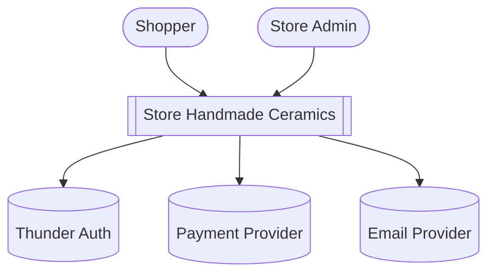
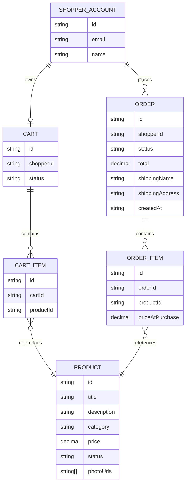
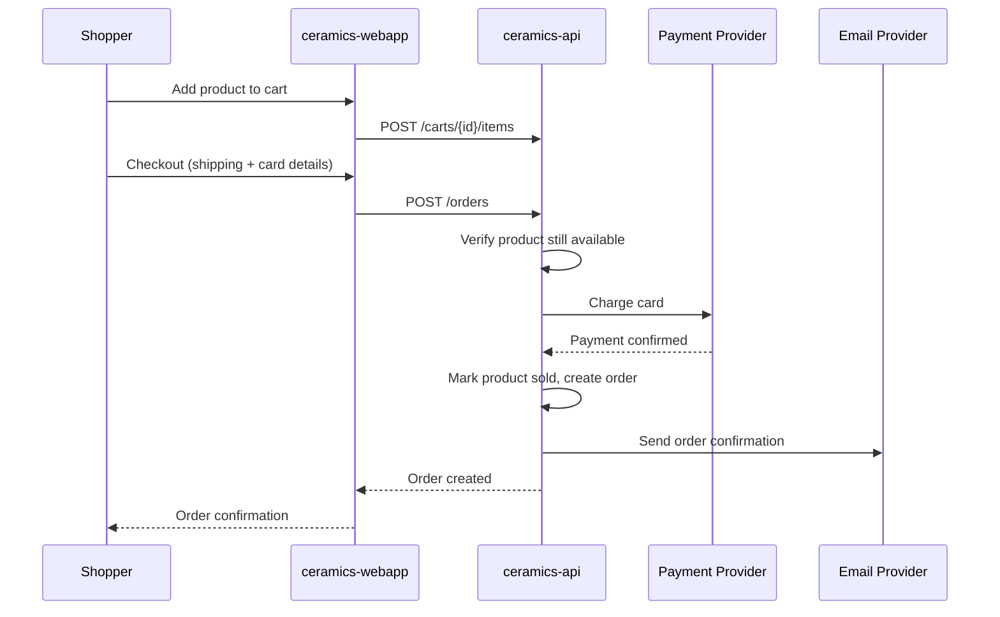
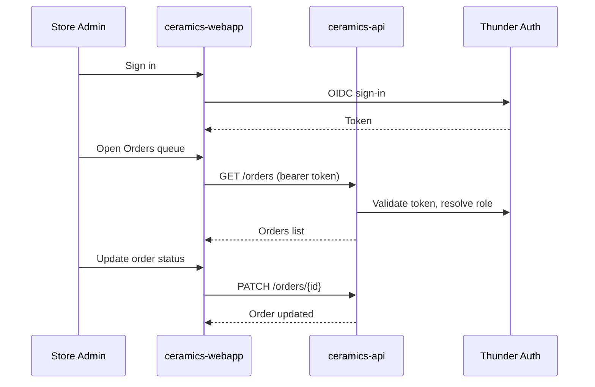

# Store Handmade Ceramics — Design

## Overview

A single-vendor storefront for handmade ceramics. Shoppers browse a catalog of one-of-a-kind pieces, add them to a cart, and check out with card payment as a guest or signed in; a Store Admin manages the catalog and fulfills orders from an admin area of the same app. The system is one React SPA (`ceramics-webapp`) talking to one Ballerina API (`ceramics-api`), which owns the catalog/cart/order data, delists a piece the instant it sells, charges the card via a hosted payment provider, and sends order-confirmation email. Sign-in for both shoppers (optional) and the admin (required) goes through Thunder, the platform IDP.

## Context (C1)

## Domain model (ER)

`PRODUCT.status` is one of `available` | `sold`. `ORDER.status` is one of
`placed` | `packed` | `shipped` | `delivered`. A guest checkout creates an
`ORDER` with no `SHOPPER_ACCOUNT` link.

## Key flows

### Guest checkout

### Admin fulfills an order

